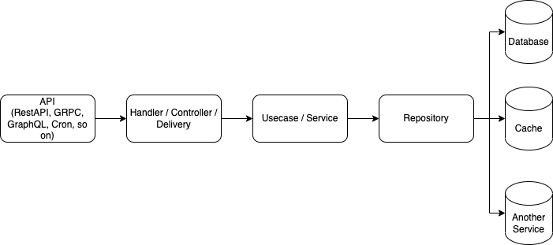

# Working with Database

# Clean Architecture

For this project we will use clean architecture. The clean architecture flow is below.

## Flow

1. The request from user, will be handle in `Controller` / `Handler` / `Delivery`.
2. In the `Controller`, it will validate the request from the user.
3. After that, it will go to `Usecase` / `Service` to process the request.
4. `Usecase` will be triggering the `Repository` to actually process to `Database` / `Cache` / `Another Service`.
5. The query of `database`, `cache` or `data from/to another service` will be running in `Repository` level.

For more details you can check [here](https://blog.cleancoder.com/uncle-bob/2012/08/13/the-clean-architecture.html).
